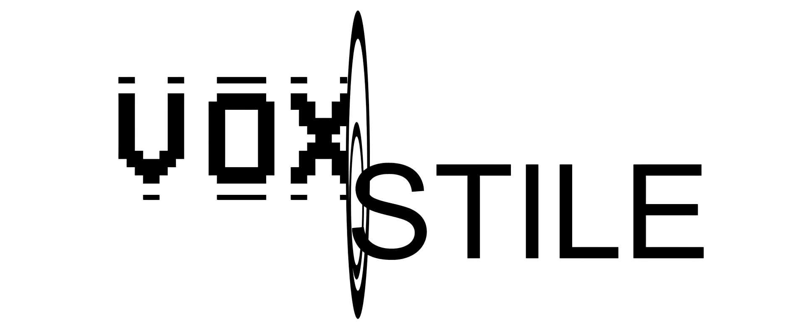
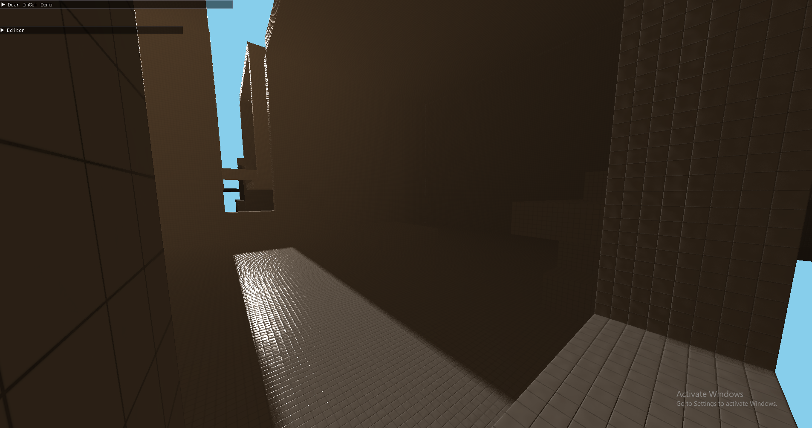
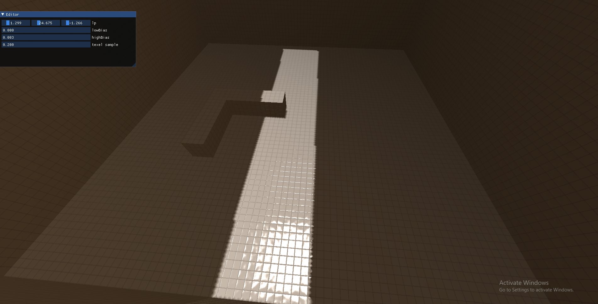
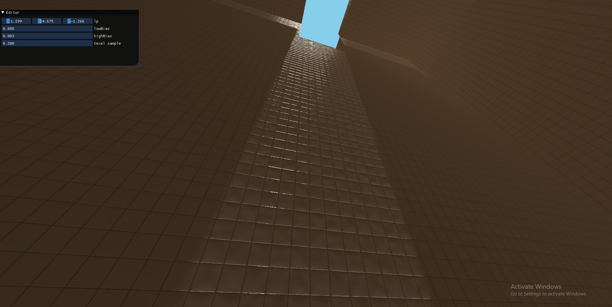
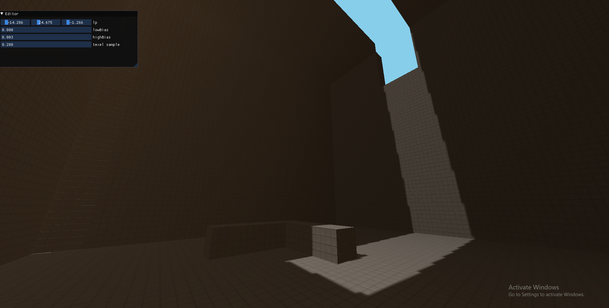

  

--------------------

<h2>Voxstile (UNDER EARLY DEVELOPMENT)</h2>
<h3>Infinite Backrooms Horror Game</h3>
Voxstile is a voxel-based horror game engine built in OpenGL, designed to generate infinite, procedurally generated Backrooms-style poolroom structures connected through non-euclidean-like portals. The game features realistic lighting, dynamic destruction, and an eerie atmosphere to immerse players in a terrifying experience.

-------------------

